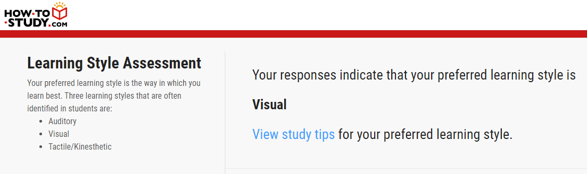
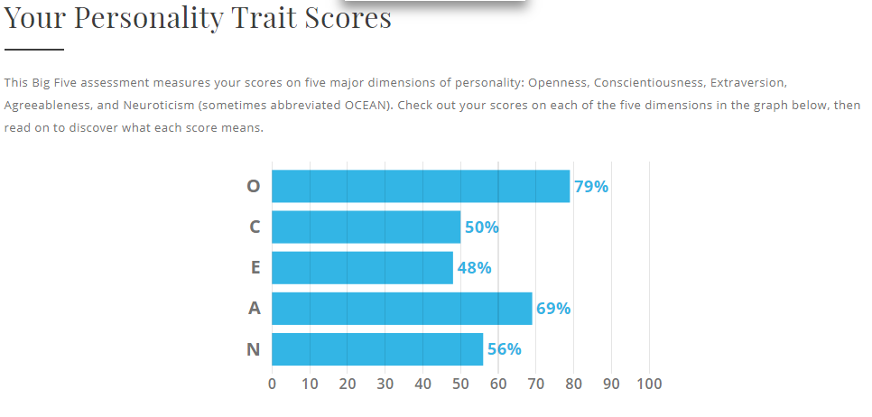

# Nathaniel Rogers - Assignment 1

Welcome to my RMIT-intro2IT-A1 intro page!

A little about me to start. I'm Nathaniel, student ID s3829502, (email: [s3829502@student.rmit.edu.au](mailto:s3829502@student.rmit.edu.au)) 25 living in Queensland, away from home and the dream to be a big grown up living in my own house was a brilliant scam, because life is so much harder as an adult. Apparently there is such thing as too much cake! (I digress) I was born and raised in Australia, moving between Queensland and New South Wales until I took two years to volunteer as a missionary for my church in Scotland and Ireland which now holds a dear place in my heart.

My Dad worked for an internationally known IT company my whole childhood so I cant really remember a time when we weren't using technology, but because it was what my dad did I didn't think it would be cool to also go into that field so I tried art instead in high school. Long story short, I was failing art so I changed to IT and everything just made sense so I succumbed and realised my future would be in IT.

*I remember spending way too much time playing this pinball game because someone was using the phone so we couldn't ALSO be on the internet. Good ol' dial up.*

I have been working for an e-commerce agency (www.neocreative.com) for three years doing module development primarily in PHP.

### Job Listing
So, being a hacker is very glamorous in movies, but doing illegal things with the risk isn't really something I want to do. Kinda conflicts with my morals. That is where penetration testing comes in.
A penetration tester is someone who is referred to as a "white hat" hacker because their job is to test companies cyber security, at their request (this is the key difference), to determine any potential threats/exploits and help the companies to secure against them, before a malicious "black hat" hacker finds them and exploits them.

There are plenty of job listings out there for penetration testing, but here is an example.
[https://www.seek.com.au/job/40557657](https://www.seek.com.au/job/40557657)

This position is appealing to me because it would require me to already have some experience with penetration testing (pentesting). Being able to have mentoring while working would beneficial to improve my skills.
The skills that would be required are:
- A strong networking understanding
- Being up to date with common attack vectors and vulnerabilities
- Ability to write a professional report
- Understand what "red team engagements" means
- A good understanding of windows and linux based command line interfaces/programs

The skills I currently have:
- A very basic understanding of networking
- The ability to write reports
- A good understanding of Powershell and Teminal usage and basic (batch, ps1 and bash) script writing

In order to increase my networking skills I have been trying to do CTF challenges (which are sandboxed pen testing challenges available to anyone)
I will need to familiarise myself with the terms used in the industry, which I imagine would come with talking with someone in the industy, looking at example reports, studying specific cyber security classes and just getting experience in the industry.

### What is my personality like?
In the [Myers Briggs personality test](https://16personalities.com) the result I got was "[The Mediator](https://www.16personalities.com/infp-personality)" (INFP)

The learning style result I got was that I am a visual learner

I chose to take the Big Five Personalities Test to learn more. Turns out my highest quality is in Openness

