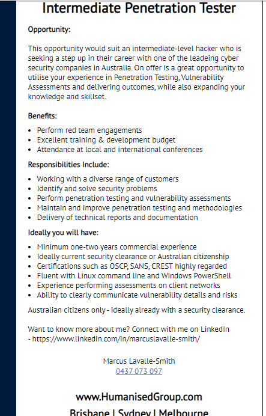

# Nathaniel Rogers - Assignment 1

Welcome to my RMIT-intro2IT-A1 intro page!

[Navigator](#)
[About Nathaniel](#about-nathaniel)
[Job Listing](#job-listing)

### About Nathaniel
A little about me to start. I'm Nathaniel, student ID s3829502, (email: [s3829502@student.rmit.edu.au](mailto:s3829502@student.rmit.edu.au)) 25 living in Queensland, away from home and the dream to be a big grown up living in my own house was a brilliant scam, because life is so much harder as an adult. Apparently there is such thing as too much cake! (I digress) I was born and raised in Australia, moving between Queensland and New South Wales until I took two years to volunteer as a missionary for my church in Scotland and Ireland which now holds a dear place in my heart.

My Dad worked for an internationally known IT company my whole childhood so I cant really remember a time when we weren't using technology, but because it was what my dad did I didn't think it would be cool to also go into that field so I tried art instead in high school. Long story short, I was failing art so I changed to IT and everything just made sense so I succumbed and realised my future would be in IT.

*I remember spending way too much time playing this pinball game because someone was using the phone so we couldn't ALSO be on the internet. Good ol' dial up.*

I have been working for an e-commerce agency (www.neocreative.com) for three years doing module development primarily in PHP.

### Job Listing
So, being a hacker is very glamorous in movies, but doing illegal things with the risk isn't really something I want to do. Kinda conflicts with my morals. That is where penetration testing comes in.
A penetration tester is someone who is referred to as a "white hat" hacker because their job is to test companies cyber security, at their request (this is the key difference), to determine any potential threats/exploits and help the companies to secure against them, before a malicious "black hat" hacker finds them and exploits them.

There are plenty of job listings out there for penetration testing, but here is an example.
[https://www.seek.com.au/job/40557657](https://www.seek.com.au/job/40557657)

This position is appealing to me because it would require me to already have some experience with penetration testing (pentesting). Being able to have mentoring while working would beneficial to improve my skills.
The skills that would be required are:
- A strong networking understanding
- Being up to date with common attack vectors and vulnerabilities
- Ability to write a professional report
- Understand what "red team engagements" means
- A good understanding of windows and linux based command line interfaces/programs

The skills I currently have:
- A very basic understanding of networking
- The ability to write reports
- A good understanding of Powershell and Teminal usage and basic (batch, ps1 and bash) script writing

In order to increase my networking skills I have been trying to do CTF challenges (which are sandboxed pen testing challenges available to anyone)
I will need to familiarise myself with the terms used in the industry, which I imagine would come with talking with someone in the industy, looking at example reports, studying specific cyber security classes and just getting experience in the industry.

### What is my personality like?
In the [Myers Briggs personality test](https://16personalities.com) the result I got was "[The Mediator](https://www.16personalities.com/infp-personality)" (INFP)

The learning style result I got was that I am a visual learner

I chose to take the Big Five Personalities Test to learn more. Turns out my highest quality is in Openness

These results mean that you can count on me to try and keep the peace between group members. That's generally at my own expense, but at least we will get the project completed. I'm a big fan of people having separate (not necessarily equal) responsibilities that each member feels is within their ability, so divying up the group work is probably where I will be able to be most useful.

### My Awesome Untitled Project

#### Overview
The project that I have come up with is to implement containerised based web page viewing restircting any access to the companies actual files. The idea would be some sort of sandbox environment that employees can use to view emails, websites etc that are potentially malicious without the risk of the companies confidential data being tainted or exposed. This could be expanded to a physical device much like a USB stick that automatically runs the safe container as a layer between the web client and the server.

#### Motivation
There has been an uprise in Malware attacks. According to Statistica, there were 10.52 billion malware attacks in 2018. Focusing on ransomeware, which is when a malicious player comehow crypto-locks all the files on the computer and demands a ransom to have the files decrypted, companies have been forced to pay a large ransoms with the hope that they get their files back, or simply lose their archives. This is a big issue that has been known to be triggered by a phishing attack, a Man in the Middle attack or even just a malicious google result. The first point of call is to limit access for the employees so in a worst case scenario only that single employees files will be locked. However this causes issues with development requirements or other business requirements.
 Find more statistics at  <a href="https://www.statista.com" rel="nofollow">Statista</a>

#### Description
The idea for this project is to use containerisation technologies (see [Docker](https://www.docker.com/) for example) to isolate the web browsing experience and avoid getting infected by malware. This tool would need to be used by people with little to no information security knowledge as experienced people in the industry would be able to identify or stop the attacks (generally) before their computers become affected. This could be installed as a sort of safe proxy type network for use in schools, hospitals, enterprise companies or individually for personal computing.

#### Tools and Technologies

<!--
Overview (100 words) - This should be a summary of what the project will be.
Motivation (100) words) - This should be a description of why the project will be
interesting or useful. This may include statistics or other evidence, such as: "There
service. are 1.5 billion cat owners in Australia, and so there is a huge market for an
automated cat feeder. Using Raspberry Pi technology is a cheap and easily
assembled solution to this problem."
Description (500 words) - Detailed description of the features of the product or
service
Tools and Technologies (100) words) - Describe the software, hardware and/or 
other equipment needed. Include any relevant open source tools as appropriate.
Skills Required (100 words) - List the skills are required for your project, including
software that needs to be written, and special hardware (if any). How feasible will it
be to find the skills, software and hardware required?
Outcome (100 words) - If the project is successful, what will be the outcome? How
will the original problem be solved? What impact will this development have?
<<<<<<< HEAD
 -->
=======
 -->
>>>>>>> b9efc0cbd75e8001c96df3cd6cb94fbd38136f24
